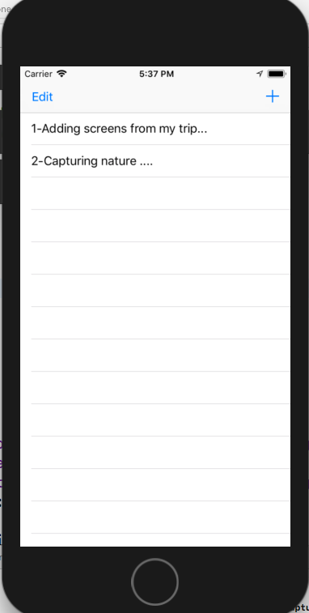
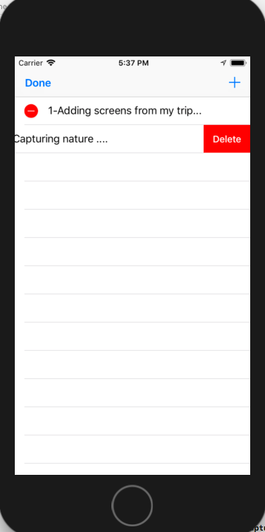
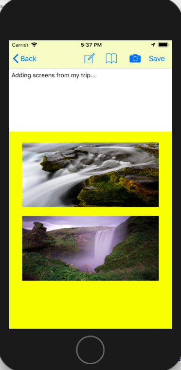

# NoteTakingAppIOS

NoteApp is an application that enables user to capture quick notes on the go and also support image capture including geo location co-ordinates to project map view on tap of image.
It also support emailing feature which includes text and photos captured as part of note creation activity.

# Technology Stack: 
SqlLite
Swift Programming 4
Xcode 9.X
IOS 9.X

# Usage Instruction & Features
To get start with this app, user has to tap "+" which takes user to the screen which allows text and image capturing facility.
Screen two comes with feature set such as browse media from album, capture live phots, edit existing notes and send email.

Screen three involves email composing and auto include of photos as attachmenst.

# Feel of an application 
   
